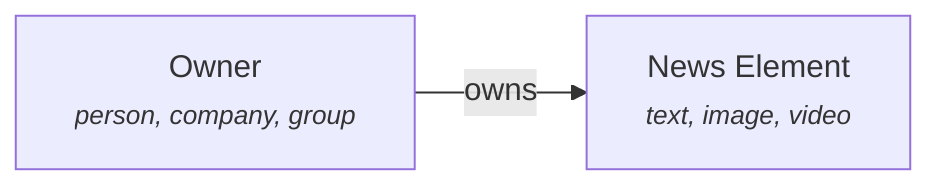
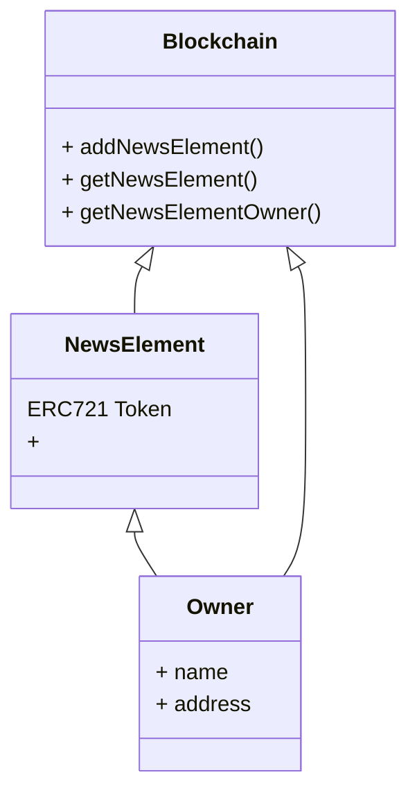

# unfakenews

## Description
This project introduce a way to validate news articles using Blockchain technology.

### General Idea

```mermaid
graph LR;
    NewsElement["`News Element
    <small>*text, image, video*</small>`"];
    Owner["`Owner
    <small>*person, company, group*</small>`"];

    Owner-- owns -->NewsElement;

```

### Interaction with Blockchain

```mermaid
classDiagram
    class NewsElement{
        ERC721 Token
        + 
    }

    class Owner{
        + name
        + address
    }

    class Blockchain{
        
        + addNewsElement()
        + getNewsElement()
        + getNewsElementOwner()
    }

    NewsElement <|-- Owner
    Blockchain <|-- NewsElement
    Blockchain <|-- Owner
```


```