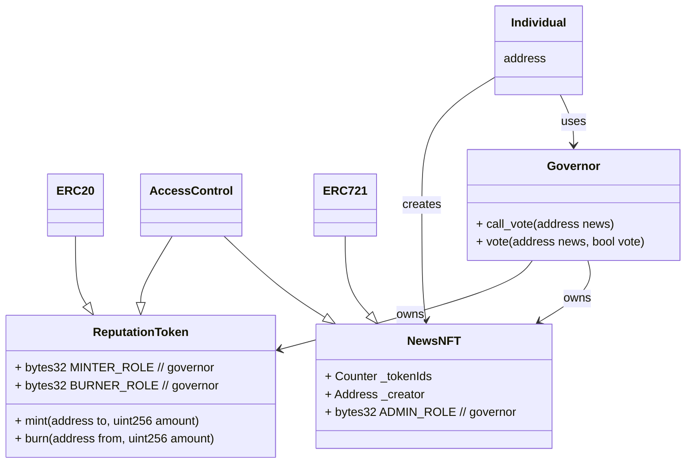

# unfakenews

## Description

This project introduce a way to validate news articles using Blockchain technology.
The Green Paper was written after completion of the seminar to formulate a hypothetical implementation in practice.

## Setup
Using VSCode is recommended. If you are using VSCode, you can start immediately by opening the project folder in VSCode, installing Remote Development extension, and launchin the devcontainer in this workspace.

## Class Diagram

